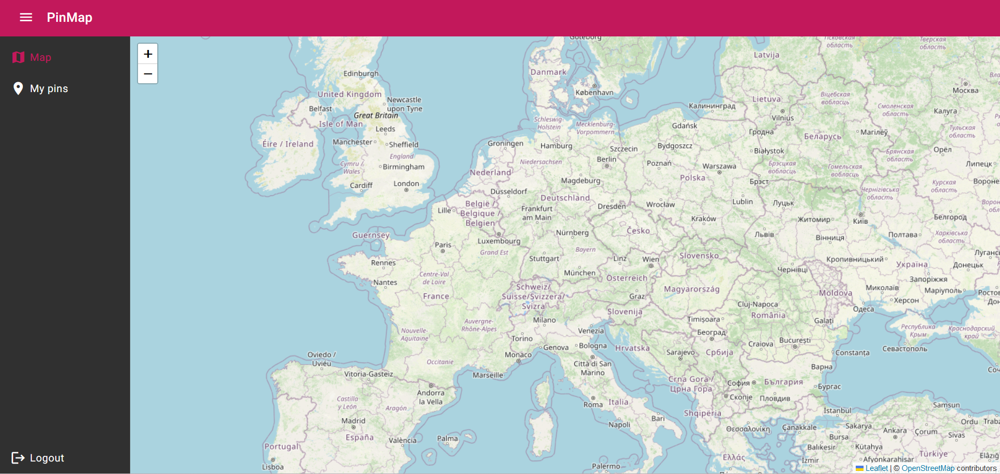

# Pin Map Project

Web project for saving localization pins on a world map. Project based on a Python Flask framework(Backend), Angular framework(Frontend) and OpenSource library Leaflet for using world map. For data storage the SQLite3 was used.

## Installing

Navigate to the back folder, then type in a terminal:

>**docker build -t flask .**

 Navigate to the front folder and type:

>**docker build -t angular .**

 At last in the main folder type:

>**docker compose up -d**

Finally you can launch app. App is available at URL: localhost:4200.

## Map look

## How to use

If you don't have account - create it. Navigate to the register page and fill the form. After successfull registration you will be able to log in. After log in you will be redirect to the main page. To add a pin press somewhere on a map - the form will appear and you can set the name, description and colour of the pin. After saving the pin, it will be shown on the map. On the left side, there is a tab called "My pins". This will redirect you to the page with a list of your pins. You can also edit or delete every pin.
